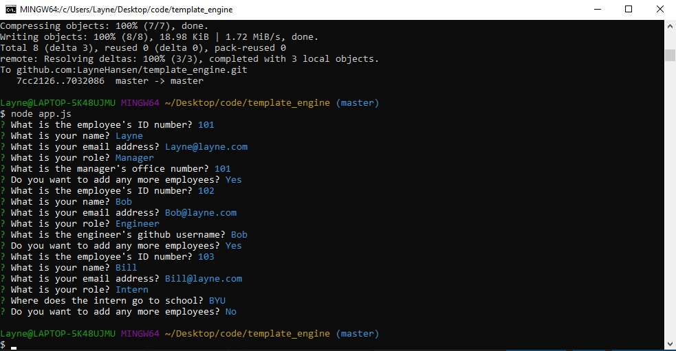

# Template Engine

## Table of Contents
* [Images](#images)
* [Description](#description)
* [Installation Instructions](#installation)
* [Usage Information](#usage)
* [Contributors](#contributor)
* [Tests](#tests)
* [License](#license)
* [Questions](#questions)

## Images
Node View:

Final Product:

## Description
This application allows the user to create cards that display information about team members. More prompts can be added as needed.

## Installation Instructions
Clone file from repository into your own repository and run from node.

## Usage Information
Those interested may use this file as needed.

## Contributors
Layne D. Hansen

## Tests 
Yes

## License
MIT_license
  
 

## Questions

For questions and comments, contact me at:

Github: [LayneHansen](https://github.com/LayneHansen)

Email: layne.d.hansen@gmail.com
    
  